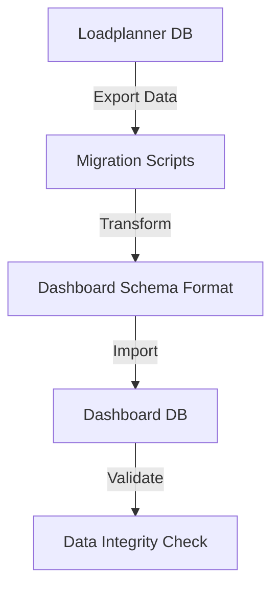
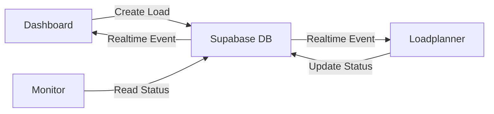

# Loadplanner & Dashboard Integration Plan

## Executive Summary

The loadplanner app currently operates with a separate Supabase instance and simplified database schema. This plan outlines the strategy to migrate the loadplanner to use the main dashboard's Supabase instance and comprehensive database structure, ensuring seamless data sharing and architectural consistency across the MAT Ecosystem.

## Current State Analysis

### Loadplanner App (Isolated)
- **Supabase Instance**: `tgqtcybixzjvdtwrojgq.supabase.co`
- **Location**: `/workspaces/mat/loadplanner`
- **Framework**: Vite + React + TypeScript
- **Database Tables** (10 tables):
  - `clients`
  - `client_feedback`
  - `custom_locations`
  - `diesel_orders`
  - `drivers`
  - `fleet_vehicles`
  - `geofence_events`
  - `loads`
  - `telematics_positions`
  - `tracking_share_links`

### Main Dashboard App (Comprehensive)
- **Supabase Instance**: `wxvhkljrbcpcgpgdqhsp.supabase.co`
- **Location**: `/workspaces/mat/src`
- **Framework**: Vite + React + TypeScript
- **Database Tables** (150+ tables including):
  - `vehicles` (instead of `fleet_vehicles`)
  - `drivers` (enhanced version)
  - `loads` (enhanced version)
  - Full fleet management system
  - Maintenance tracking
  - Inspection system
  - Tyre management
  - Fuel management
  - Job cards & work orders
  - And many more...

## Key Differences Identified

### 1. **Supabase Configuration**
```typescript
// Loadplanner (loadplanner/src/integrations/supabase/client.ts)
const SUPABASE_ANON_KEY = import.meta.env.VITE_SUPABASE_ANON_KEY;

// Dashboard (src/integrations/supabase/client.ts)
const SUPABASE_PUBLISHABLE_KEY = import.meta.env.VITE_SUPABASE_PUBLISHABLE_KEY 
  || import.meta.env.VITE_SUPABASE_ANON_KEY;
```

### 2. **Table Structure Differences**

#### Fleet Vehicles
- **Loadplanner**: `fleet_vehicles` table with fields:
  - `id`, `vehicle_id` (text), `type`, `capacity`, `available`
  
- **Dashboard**: `vehicles` table with extensive fields:
  - `id`, `fleet_number`, `registration_number`, `make`, `model`, `vehicle_type`
  - Plus: maintenance tracking, odometer, license info, etc.

#### Drivers
- **Loadplanner**: Basic `drivers` table
  - `id`, `name`, `contact`, `available`
  
- **Dashboard**: Enhanced `drivers` table
  - Additional fields for documents, licenses, performance tracking

#### Loads
- **Loadplanner**: Simplified `loads` table
  - References `fleet_vehicle_id` and `driver_id`
  - Basic status tracking
  
- **Dashboard**: Comprehensive `loads` table
  - References `assigned_vehicle_id` (to `wialon_vehicles` or `vehicles`)
  - Advanced tracking with GPS integration
  - Performance metrics, ETAs, delivery tracking

### 3. **Environment Variables**
```bash
# Loadplanner (.env)
VITE_SUPABASE_URL=https://tgqtcybixzjvdtwrojgq.supabase.co
VITE_SUPABASE_ANON_KEY=...

# Dashboard (.env)
VITE_SUPABASE_URL=https://wxvhkljrbcpcgpgdqhsp.supabase.co
VITE_SUPABASE_ANON_KEY=...
VITE_WIALON_TOKEN=...
```

## Integration Strategy

### Phase 1: Environment & Configuration Alignment

#### 1.1 Update Loadplanner Environment
```bash
# loadplanner/.env (NEW)
VITE_SUPABASE_URL=https://wxvhkljrbcpcgpgdqhsp.supabase.co
VITE_SUPABASE_ANON_KEY=eyJhbGciOiJIUzI1NiIsInR5cCI6IkpXVCJ9...
VITE_SUPABASE_PUBLISHABLE_KEY=eyJhbGciOiJIUzI1NiIsInR5cCI6IkpXVCJ9...
VITE_WIALON_TOKEN=c1099bc37c906fd0832d8e783b60ae0dC1919858364166F6044AACC3B8167B56063C0583
```

#### 1.2 Update Supabase Client
Modify [`loadplanner/src/integrations/supabase/client.ts`](loadplanner/src/integrations/supabase/client.ts:1) to match dashboard pattern:

```typescript
const SUPABASE_PUBLISHABLE_KEY = 
  import.meta.env.VITE_SUPABASE_PUBLISHABLE_KEY || 
  import.meta.env.VITE_SUPABASE_ANON_KEY;

export const supabase = createClient<Database>(
  SUPABASE_URL, 
  SUPABASE_PUBLISHABLE_KEY, 
  {
    auth: {
      storage: localStorage,
      persistSession: true,
      autoRefreshToken: true,
    }
  }
);
```

### Phase 2: Database Schema Migration

#### 2.1 Data Migration Strategy



#### 2.2 Table Mapping

| Loadplanner Table | Dashboard Table | Migration Notes |
|-------------------|-----------------|-----------------|
| `fleet_vehicles` | `vehicles` | Map `vehicle_id` → `fleet_number`, add required fields |
| `drivers` | `drivers` | Merge data, preserve IDs if possible |
| `loads` | `loads` | Update foreign keys: `fleet_vehicle_id` → `assigned_vehicle_id` |
| `clients` | `clients` | Direct migration, schema compatible |
| `diesel_orders` | `diesel_records` | Map to dashboard's diesel management |
| `custom_locations` | `predefined_locations` | Merge with existing locations |
| `geofence_events` | `geofence_events` | Direct migration |
| `telematics_positions` | Create if needed | May integrate with Wialon data |
| `tracking_share_links` | `tracking_share_links` | Direct migration |

#### 2.3 Migration SQL Script Template

```sql
-- Step 1: Backup existing loadplanner data
CREATE TABLE loadplanner_backup_fleet_vehicles AS 
SELECT * FROM fleet_vehicles;

-- Step 2: Migrate fleet_vehicles to vehicles
INSERT INTO vehicles (
  id,
  fleet_number,
  registration_number,
  vehicle_type,
  active,
  created_at,
  updated_at
)
SELECT 
  id,
  vehicle_id as fleet_number,
  vehicle_id as registration_number, -- Placeholder, needs manual update
  type as vehicle_type,
  available as active,
  created_at,
  updated_at
FROM loadplanner_backup_fleet_vehicles
ON CONFLICT (id) DO NOTHING;

-- Step 3: Update loads table foreign keys
UPDATE loads 
SET assigned_vehicle_id = fleet_vehicle_id
WHERE fleet_vehicle_id IS NOT NULL;

-- Step 4: Drop old columns (after validation)
-- ALTER TABLE loads DROP COLUMN fleet_vehicle_id;
```

### Phase 3: Code Refactoring

#### 3.1 Update Type Definitions

Generate new types from dashboard database:
```bash
cd loadplanner
npx supabase gen types typescript --project-id wxvhkljrbcpcgpgdqhsp > src/integrations/supabase/types.ts
```

#### 3.2 Update Data Access Layer

**Before (Loadplanner):**
```typescript
// loadplanner/src/hooks/useFleetVehicles.ts
const { data: vehicles } = useQuery({
  queryKey: ['fleet_vehicles'],
  queryFn: async () => {
    const { data } = await supabase
      .from('fleet_vehicles')
      .select('*')
      .order('vehicle_id');
    return data;
  }
});
```

**After (Dashboard-compatible):**
```typescript
// loadplanner/src/hooks/useFleetVehicles.ts
const { data: vehicles } = useQuery({
  queryKey: ['vehicles'],
  queryFn: async () => {
    const { data } = await supabase
      .from('vehicles')
      .select('id, fleet_number, registration_number, vehicle_type, active')
      .eq('active', true)
      .order('fleet_number');
    return data;
  }
});
```

#### 3.3 Component Updates

Files requiring updates:
- [`loadplanner/src/components/fleet/CreateFleetDialog.tsx`](loadplanner/src/components/fleet/CreateFleetDialog.tsx:1)
- [`loadplanner/src/components/fleet/EditFleetDialog.tsx`](loadplanner/src/components/fleet/EditFleetDialog.tsx:1)
- [`loadplanner/src/components/loads/CreateLoadDialog.tsx`](loadplanner/src/components/loads/CreateLoadDialog.tsx:1)
- [`loadplanner/src/components/loads/EditLoadDialog.tsx`](loadplanner/src/components/loads/EditLoadDialog.tsx:1)
- [`loadplanner/src/components/loads/LoadsTable.tsx`](loadplanner/src/components/loads/LoadsTable.tsx:1)
- [`loadplanner/src/hooks/useFleetVehicles.ts`](loadplanner/src/hooks/useFleetVehicles.ts:1)
- [`loadplanner/src/hooks/useLoads.ts`](loadplanner/src/hooks/useLoads.ts:1)

### Phase 4: Shared Infrastructure

#### 4.1 Create Shared Package Structure

```
/workspaces/mat/
├── packages/
│   └── shared/
│       ├── types/
│       │   ├── database.ts      # Shared DB types
│       │   ├── loads.ts         # Load-related types
│       │   ├── vehicles.ts      # Vehicle types
│       │   └── drivers.ts       # Driver types
│       ├── schemas/
│       │   ├── loadSchema.ts    # Zod schemas
│       │   └── vehicleSchema.ts
│       ├── utils/
│       │   ├── supabase.ts      # Shared client config
│       │   └── formatting.ts    # Common formatters
│       └── hooks/
│           ├── useVehicles.ts   # Shared vehicle hook
│           └── useLoads.ts      # Shared loads hook
```

#### 4.2 Update Package References

**Dashboard tsconfig.json:**
```json
{
  "compilerOptions": {
    "paths": {
      "@/*": ["./src/*"],
      "@shared/*": ["../packages/shared/*"]
    }
  }
}
```

**Loadplanner tsconfig.json:**
```json
{
  "compilerOptions": {
    "paths": {
      "@/*": ["./src/*"],
      "@shared/*": ["../packages/shared/*"]
    }
  }
}
```

### Phase 5: Authentication & Authorization

#### 5.1 Unified Auth Strategy

Both apps will use the same Supabase Auth instance:
- Single sign-on across dashboard and loadplanner
- Shared user sessions via localStorage
- Consistent RLS policies

#### 5.2 RLS Policy Alignment

Ensure loadplanner respects dashboard's Row Level Security:
```sql
-- Example: Loads table RLS
CREATE POLICY "Authenticated users can view loads"
  ON public.loads FOR SELECT
  TO authenticated
  USING (true);

CREATE POLICY "Authenticated users can manage loads"
  ON public.loads FOR ALL
  TO authenticated
  USING (true);
```

### Phase 6: Real-time Synchronization

#### 6.1 Supabase Realtime Setup

Enable real-time for critical tables:
```typescript
// loadplanner/src/hooks/useLoads.ts
useEffect(() => {
  const channel = supabase
    .channel('loads-changes')
    .on(
      'postgres_changes',
      { event: '*', schema: 'public', table: 'loads' },
      (payload) => {
        queryClient.invalidateQueries(['loads']);
      }
    )
    .subscribe();

  return () => {
    supabase.removeChannel(channel);
  };
}, []);
```

#### 6.2 Cross-App Data Flow



## Implementation Checklist

### Pre-Migration
- [ ] Backup loadplanner database completely
- [ ] Document all custom business logic in loadplanner
- [ ] Identify data dependencies and relationships
- [ ] Create rollback plan

### Migration Execution
- [ ] Update loadplanner `.env` with dashboard Supabase credentials
- [ ] Update Supabase client configuration
- [ ] Run database migration scripts
- [ ] Validate data integrity
- [ ] Update TypeScript types
- [ ] Refactor data access hooks
- [ ] Update all components using old table names
- [ ] Test authentication flow
- [ ] Test real-time synchronization

### Post-Migration
- [ ] Comprehensive testing of all loadplanner features
- [ ] Performance testing with dashboard data volume
- [ ] User acceptance testing
- [ ] Monitor error logs for 48 hours
- [ ] Document new architecture
- [ ] Update deployment scripts

## Risk Assessment & Mitigation

### High Risk Areas

#### 1. Data Loss During Migration
**Risk**: Incomplete or failed data migration
**Mitigation**: 
- Full database backup before migration
- Dry-run migration in staging environment
- Incremental migration with validation checkpoints
- Keep old database accessible for 30 days

#### 2. Breaking Changes in Loadplanner
**Risk**: Features stop working after migration
**Mitigation**:
- Comprehensive test coverage before migration
- Feature-by-feature validation
- Staged rollout (dev → staging → production)
- Quick rollback procedure documented

#### 3. Performance Degradation
**Risk**: Dashboard database is larger, queries may be slower
**Mitigation**:
- Index optimization on frequently queried fields
- Query performance testing
- Implement caching where appropriate
- Monitor query execution times

#### 4. Authentication Issues
**Risk**: Users unable to access loadplanner after migration
**Mitigation**:
- Test auth flow thoroughly in staging
- Maintain session compatibility
- Clear communication to users about any changes
- Support team briefed on potential issues

## Testing Strategy

### Unit Tests
```typescript
// Example: Test vehicle data access
describe('useVehicles hook', () => {
  it('should fetch vehicles from dashboard schema', async () => {
    const { result } = renderHook(() => useVehicles());
    await waitFor(() => expect(result.current.data).toBeDefined());
    expect(result.current.data[0]).toHaveProperty('fleet_number');
    expect(result.current.data[0]).toHaveProperty('registration_number');
  });
});
```

### Integration Tests
- Test load creation from loadplanner appears in dashboard
- Test vehicle assignment updates in real-time
- Test driver availability synchronization
- Test geofence event logging

### E2E Tests
- Complete load planning workflow
- Vehicle allocation and tracking
- Driver assignment and management
- Client portal access

## Deployment Strategy

### Staging Deployment
1. Deploy updated loadplanner to staging environment
2. Point to dashboard's staging Supabase instance
3. Run migration scripts on staging data
4. Conduct full regression testing
5. Performance benchmarking

### Production Deployment
1. Schedule maintenance window (low-traffic period)
2. Notify all users 48 hours in advance
3. Create production database backup
4. Execute migration scripts
5. Deploy updated loadplanner code
6. Smoke test critical features
7. Monitor for 2 hours post-deployment
8. Send all-clear notification

### Rollback Plan
If critical issues arise:
1. Revert loadplanner code to previous version
2. Restore loadplanner `.env` to old Supabase instance
3. Notify users of temporary rollback
4. Investigate issues in staging
5. Schedule new deployment window

## Success Metrics

### Technical Metrics
- [ ] 100% data migration success rate
- [ ] Zero data loss
- [ ] Query performance within 10% of baseline
- [ ] Real-time sync latency < 2 seconds
- [ ] Zero authentication failures

### Business Metrics
- [ ] All loadplanner features functional
- [ ] Dashboard can view loadplanner-created loads
- [ ] Cross-app data consistency maintained
- [ ] User satisfaction maintained or improved

## Timeline Estimate

| Phase | Duration | Dependencies |
|-------|----------|--------------|
| Phase 1: Configuration | 1 day | None |
| Phase 2: Schema Migration | 3 days | Phase 1 complete |
| Phase 3: Code Refactoring | 5 days | Phase 2 complete |
| Phase 4: Shared Infrastructure | 3 days | Phase 3 complete |
| Phase 5: Auth & Authorization | 2 days | Phase 1 complete |
| Phase 6: Real-time Sync | 2 days | Phase 3 complete |
| Testing & Validation | 5 days | All phases complete |
| Staging Deployment | 2 days | Testing complete |
| Production Deployment | 1 day | Staging validated |
| **Total** | **24 days** | |

## Maintenance & Support

### Post-Migration Support
- Dedicated support channel for 2 weeks post-migration
- Daily monitoring of error logs
- Weekly performance reviews for first month
- Monthly architecture review for first quarter

### Documentation Updates
- Update loadplanner README with new architecture
- Create migration guide for future reference
- Document shared infrastructure usage
- Update API documentation

## Conclusion

This migration will unify the loadplanner and dashboard apps under a single Supabase instance, enabling seamless data sharing and real-time synchronization across the MAT Ecosystem. The phased approach minimizes risk while ensuring comprehensive testing and validation at each stage.

**Key Benefits:**
- ✅ Single source of truth for all fleet data
- ✅ Real-time synchronization across apps
- ✅ Reduced infrastructure complexity
- ✅ Improved data consistency
- ✅ Foundation for future ecosystem expansion

**Next Steps:**
1. Review and approve this plan
2. Set up staging environment
3. Begin Phase 1 implementation
4. Schedule regular progress reviews
